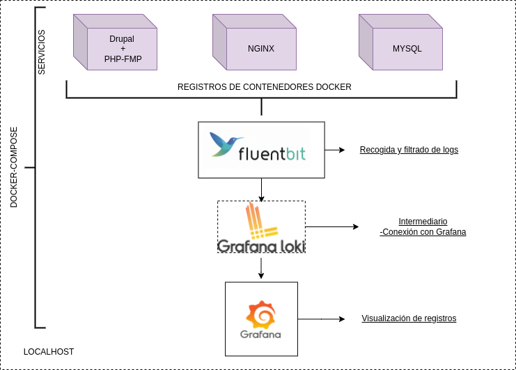

# Logging Fluent-bit + Loki & Grafana en Docker

### Objetivo:

Reflejar logs de los diferentes contenedores en Grafana

Este entorno se despliega con docker-compose.

Se compone de:

* Servidor Web Nginx 
* Base de datos MySQL
* Drupal con PHP-FPM
* Fluent-bit
* Loki
* Grafana

## Gráfico 



### Requisitos 

- Docker y Docker Compose instalados
- Git instalado

### Clonar el repositorio 

```shell 
git clone https://github.com/CeliaGMqrz/fluent-bit_loki_grafana__docker-drupal
```

### Crear el directorio de datos 

```shell 
mkdir -p storage/files storage/mysql
```

### Construir las imágenes 

Necesitamos construir las imágenes para nuestro entorno, para ello:

Ejecuta el pequeño script `bash build_images.sh`


### Cargar las variables de entorno 

Cargamos las variables de entorno necesarias para el escenario, ya que están incluidas en el fichero `docker-compose.yaml`

!! No te olvides de modificar las variables para tu proyecto.

> Estas credenciales solo son muestras de prueba. Se recomienda usar contraseñas seguras.

Las encuentras en el fichero `.env` en el repositorio

### Configuración del entorno 

#### Fluent-bit 

[[Documentación oficial]](https://fluentbit.io/)

Fluent Bit procesa y reenvía los registros o logs, en este caso se conecta a **Grafana** a través de **loki**. También es capaz de recopilar datos (métricas) y filtrar esos datos según necesitemos.

Es eficiente ya que cuenta con un alto rendimiento y un bajo uso de CPU y memoria.

Hemos usado una imagen dockerizada de fluent-bit especialmente para Loki

`grafana/fluent-bit-plugin-loki`

En el fichero yml está expuesto de la siguiente forma:

```shell
  fluentd:
    container_name: fluentd
    image: grafana/fluent-bit-plugin-loki
    ports:
      - 24224:24224
      - 24224:24224/udp
    environment:
      LOKI_URL: http://loki:3100/loki/api/v1/push
    volumes:
      - ./fluent-bit/fluent-bit.conf:/fluent-bit/etc/fluent-bit.conf
    networks:
      - milocal

```

`fluent-bit.conf`

En el fichero de configuración de fluent indicamos la Url de Loki que la hemos indicado en las variables de entorno del fichero yml. Y las etiquetas que queramos, en este caso está separado por **nombre de contenedor**.

```shell
. . . 
. . . 

[INPUT]
    Name              forward
    Listen            0.0.0.0
    Port              24224
    Buffer_Chunk_Size 1M
    Buffer_Max_Size   6M

[Output]
    Name grafana-loki
    Match *
    Url ${LOKI_URL}
    RemoveKeys source,container_id
    Labels {job="fluent-bit"}
    LabelKeys container_name
    BatchWait 1s
    BatchSize 1001024
    LineFormat json
    LogLevel info

```

#### Entorno drupal

No vamos a entrar en detalles con los contenedores de drupal, nginx y mysql ya que el objetivo de este posts se enfoca en la obtención y salida de logs.

Pero sí tenemos que añadir el parámetro `logging` a los servicios que queramos monitorizar o más bien obtener logs de ellos.

fichero `docker-compose.yaml`
```shell
    logging:
      driver: fluentd
      options:
        fluentd-async-connect: "true"
        fluentd-address: localhost:24224
        tag: nginx.logs
```

`logging` es donde vamos a especificar el controlador de registro que en este caso es `fluentd` y le indicamos una etiqueta para diferenciarlos del resto.


### Desplegar el entorno 

Lanzamos docker-compose up, en el directorio principal donde se encuentra el fichero yml

```shell
docker-compose up -d
```

### Contenedores en funcionamiento:

```shell
cgarcia@ws-cgarcia:~/Projects/fluent-bit_loki_grafana__docker-drupal$ docker-compose ps
  Name                Command               State                                                  Ports                                                
--------------------------------------------------------------------------------------------------------------------------------------------------------
drupal_c   docker-php-entrypoint php- ...   Up      9000/tcp                                                                                            
fluentd    /fluent-bit/bin/fluent-bit ...   Up      2020/tcp, 0.0.0.0:24224->24224/tcp,:::24224->24224/tcp, 0.0.0.0:24224->24224/udp,:::24224->24224/udp
grafana    /run.sh                          Up      0.0.0.0:3000->3000/tcp,:::3000->3000/tcp                                                            
loki       /usr/bin/loki -config.file ...   Up      0.0.0.0:3100->3100/tcp,:::3100->3100/tcp                                                            
mysql_c    docker-entrypoint.sh mysqld      Up      3306/tcp, 33060/tcp                                                                                 
nginx_c    /bin/bash /assets/bin/dock ...   Up      0.0.0.0:443->443/tcp,:::443->443/tcp, 0.0.0.0:80->80/tcp,:::80->80/tcp   
```

### Si entramos a Grafana http://localhost:3000

Indicamos las credenciales y podemos ver el Dashboard de Grafana. Accedemos a la `Configuración` >> `Data Sources`


Como podemos comprobar se ha añadido el datasource de loki, ya que se lo hemos añadido en el fichero `datasource.yml`


Ahora vamos a `Explore` y comprobamos que tenemos todos los registros por cada contenedor. 


Además, podemos hacer consultas más específicas añadiendo filtros según el [lenguaje LogQL](https://grafana.com/docs/loki/latest/logql/#line-filter-expression) de Loki(Grafana). Como en el siguiente ejemplo filtrando por página no encontrada con error (404).


